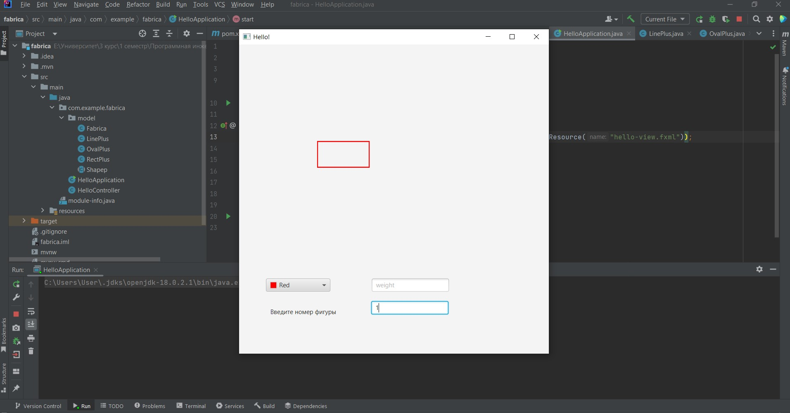

# Task2
## В ходе выполнения задания, в практической работе были реализованы:
-   Фабричный метод для создания различных фигур Fabrica
-   Абстрактный супер класс Shapep
-   Абстрактный метод Draw для  рисования фигуры, класса Shapep
### Каждая фигура представлена отдельным классом унаследованным от класса Shape, содержащего абстрактные метод Draw():
-   Класс LinePlus, наследующий класс Shapep, который отвечает за рисование линии 
-   Класс OvalPlus, наследующий класс Shapep, который отвечает за рисование круга
-   Класс RectPlus, наследующий класс Shapep, который отвечает за рисование прямоугольника

